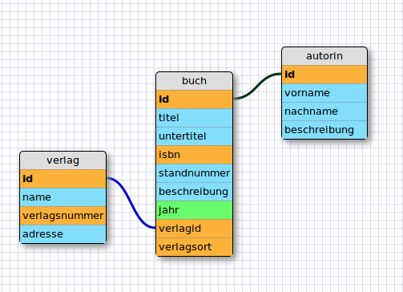
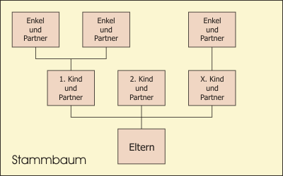
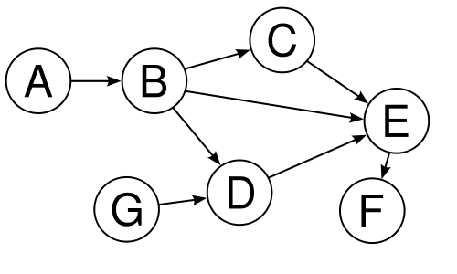

<!---
do NOT rename this File
-->

[english version available](../en/.object_modeling.md)

# Modellierung von Objekten

## Einführung

## das Hauptmenü

* **"new Object"** erzeugt ein neues Objekt auf der Bühne. In dem Popup-Fenster muss zunächst ein (eindeutiger) Name eingegeben werden[^object_naming]. Anschliessend wird das neue Objekt unterhalb des Menüs auf der Bühne platziert von wo es sich an die gewünschte Position ziehen lässt[^dd_multiple].
* **"Export"** öffnet den Dialog zum Bearbeiten und exportieren des Modells.
  * *"rebuild from Input"* lädt die Json-Struktur aus dem Textfeld in die Bühne. So können Änderungen am Modell auch direkt vorgenommen werden und (Teil-)Modelle per copy&paste hinzugefügt werden.
  * *"sort Objects internally"* öffnet eine sortierbare Liste der Objekte. So lässt sich die die Reihenfolge der Abeitsbereiche im Backend ändern.
  * *"save Model"* speichert das Modell ohne es in Datenbank und Arbeitsmodell zu überführen. So lassen sich zwischenschritte bei der überarbeitung des Modells festhalten ohne den laufenden Betrieb zu beeinflussen.
  * *"export Model"* ruft *optional* die Datenbankverwaltung auf, damit eine Sicherung der Datebank vorgenommen werden kann oder -wenn ersteres abgebrochen wird- schreibt schliesslich das Modell in Datenbank und Arbeitsmodell. Hier wird also aus dem Modell Realität! In der nachgeschalteten Modell-Prozessierung werden die Änderungen an der Datenbank (als SQL-Queries) und Links auf die erzeugten/aktualisierten PHP-Klassen ausgegeben. 
Automatisch angelegte Sicherungskopien der Datenbankinhalte und der alten Modelle erlauben die Wiederherstellung versehentlich überschriebener Inhalte.
* die **"Radar-Ansicht"** öffnet eine miniaturisierte Übersicht über die gesamte Arbeitsfläche. Hier können die Objekte gefunden werden und der derzeitige Ausschnitt (repräsentiert als rotes Kästchen) per drag&drop an die entsprechende Stelle gezogen werden
* **"Help"** öffnet schliesslich dieses Dokument ;-)

[^object_naming] : Objekte, deren Name mit Unterstrich anfangen gelten als systemintern (dies hat keinen technischen Grund)
[^dd_multiple] : Die Boxen lassen sich per Drag&Drop auf der Bühne anordnen. Mehrere Boxen lassen sich per Shift+Klick markieren und als Gruppe verschieben

## Objekte

Ein Objekt wird als Box dargestellt in der Datenfelder angelegt werden können. Tooltips verraten die jeweilige Funktion der Icons.

### Datenfelder

Bei der Erzeugung eines neuen Objekts wird automatisch ein Feld mit dem Namen "id" angelegt. Dieses Feld ist notwendig, um im System die Einträge eindeutig zu referenzieren. Es kann/darf nicht umbenannt werden. Das Feld "id" beherbergt zwei Icons, die Verknüpfungen zu anderen Objekten ermöglichen (siehe "Relationen").

Daten-Felder lassen sich in dem Objekt über das Symbol (+) anlegen. Hier öffnet sich ein Popup-Fenster, in dem der Feldname eingegeben werden muss. Der Feldname darf -wie der Objektname- keine Leer- und Umlaute enthalten und wird klein geschrieben. Wird der Name nachträglich geändert (z.B. direkt im Json) kann das zu Problemen mit bestehenden Daten führen (da im Prinzip ein neues Feld angenommen wird).

#### "magische" Feldnamen im Backend

Einige Feldnamen haben *für das Backend von cms-kit*[^magicfields_in_backend] eine bestimmte Bedeutung und sollten entweder mit Bedacht gewählt werden!

  * **"id"**: Felder mit der Endung "id" sind für Datenbank-IDs da. Diese werden grundsätzlich nicht im Backend angezeigt.
  * **"sort"**: endet ein Feld auf "sort" wird ebenfalls von einem system-internen Wert ausgegangen und das Feld ausgeblendet.
  * **"c_"**: Feldnamen, denen ein  "c_" vorangestellt wird werden automatisch per Blowfish verschlüsselt![^nosearch] Dies ist vor allem Sinnvoll wenn die Daten(bank) an Externe weitergegeben wird. Dem Eingabefeld sollte der Wizard "fieldpassword" zugeordnet werden.
  * **"e_"**: sollen Inhalte Base64 encodiert werden muss dem Feldnamen ein "e_" vorangestellt werden.

[^magicfields_in_backend] : die Funktionen für magische Feldnamen sind nicht in den Datenbank-Klassen hinterlegt und stehen so nicht automatisch für die eigenen Applikationen zur Verfügung!

[^nosearch] : Das Feld lässt sich damit nicht mehr über interne Volltext-Suche durchsuchen!

#### Generische Modelle

Wird ein Feld der Dateityp "Modell" zugeordnet wird das Feld als "Generisches Modell" interpretiert. Damit lassen sich *pro Eintrag* zusätzliche Eingabefelder definieren. Mehr zu Generischen Modellen [hier](Generische_Modelle.md).

### Einstellungen für Felder

Felder bieten folgende Einstellungen

#### Sprachen

Für die Ausgabe im Backend lassen sich für jede Sprache entsprechende Übersetzungen des Feldnamens anlegen. Jede Übersetzung beginnt mit dem Länderkürzel gefolgt von einem Doppelpunkt und wird in *eine* eigene Zeile geschrieben.

Beispiel für einfache Sprach-Labels:

    de:mein toller Bereich
    en:my great Section

Über die Sprach-Labels lassen sich die Formularfelder zusätzlich anreichern und strukturieren

##### Tabs und Akkordions

@import(.tabs_accordions.md)

##### Tooltip, Hilfe-Popup und Placeholder

Sollen dem Feld *zusätzliche Informationen* wie Tooltips, Hilfetexte im Popup-Fenster und Anweisungen zur Eingabe mitgegeben werden, kann das Label mit einem *Tooltip*[^Tooltip] und Link auf einen Hilfetext und das Eingabefeld mit einem *Placeholder*[^Placeholder] ausgestattet werden.
   
* Tooltip: Tooltip-Text in runden Klammern *de: Feld-Label (Tooltip Text mit HTML)*
* Hilfetext: Pfad (ausgehend vom Backend) auf die Hilfedatei in spitzen Klammern *de: Feld-Label <pfad/auf/die/datei.md#optionaler_anker>*
* Placeholder: Placeholder-Text in eckigen Klammern *de: Feld-Label [Placeholder-Text OHNE HTML]*

[^Tooltip] : Ein Tooltip ist eine kleine Info-Blase, die eingeblendet wird sobald die Maus über das Label fährt. das Label selbst wird kursiv dargestellt.
[^Placeholder] : Ein Placeholder ist ein Informationstext der in dem leeren Eingabefeld erscheint. 

#### Datentyp

Mit dem Datentyp lässt sich auswählen, welches Eingabefeld im Backend gezeichnet wird. Je nach Typ können weitere Parameter in dem darauffolgenden Feld "Wizard" hinterlegt werden.
Wird ein Wizard-Eingabefeld gewählt lässt sich hier ein Wizard auswählen. Der Aufruf wird automatisch in das darunter liegende Feld "Addition" geschrieben.

#### Filter

Hier lässt sich ein Daten-Filter hinterlegen wie z.B.

	FILTER_SANITIZE_EMAIL

oder

	FILTER_SANITIZE_SPECIAL_CHARS:FILTER_FLAG_STRIP_LOW

mehr zu Filtern: <http://www.php.net/manual/en/filter.filters.sanitize.php>

XSS-Schutz bei HTML-Ausgabe sollte bei Bedarf zusätzlich angewendet werden: <http://htmlpurifier.org>

#### Default-Value

Hier kann ein vorgegebener Wert *für einen neuen Eintrag* angegeben werden. Wird dem Wert der Begriff "function:" vorangestellt, wird das Feld mit dem hier angegebenen PHP-Funktionsaufruf belegt (Beispiele finden sich bei den Datumsfeldern).

#### Addition

Hier lassen sich zusätzliche Parameter für ein Feld hinterlegen.

* Parameter für "data-"Attribute bei normalen Eingabefeldern (Strings, numerische Felder und Textfelder). Hier können beliebige Informationen übergeben werden. Derzeit werden im Javascript folgende Attribute berücksichtigt.
  * mask: Dieses Attribut fügt dem Feld eine Eingabemaske für ein bestimmtes Eingabeschema hinzu. Mehr dazu [hier](http://digitalbush.com/projects/masked-input-plugin)  
Beispiel-Eingabe im Feld Addition:  
mask:(999) 999-9999
  * type: Dieses Attribut verpasst dem Feld ein anderen Typ (hoffentlich auch im IE...). HTML5-Browser unterstützen (zukünftig) entsprechende Zusatzfunktionen. [Werte](http://www.w3schools.com/html/html5_form_input_types.asp)  
Beispiel-Eingabe im Feld Addition:  
type:email
* Parameter zum Aufruf eines Wizards: Dies geschieht meist über die Auswahl des Wizards aus dem Dropdown und kann hier angepasst werden. (Die gross geschriebenen Begriffe unten sind Platzhalter.)
   * wizard:WIZARD_NAME 
   * param:ZUSÄTZLICHE_PARAMETER
   * icon:ICON_NAME
   * label:LABEL_NAME

#### Tags

Die Angabe von Tags dient zur Beschreibung des Felds (dies kann z.B. genutzt werden um Datenstrukturen automatisch in andere Systeme zu übertragen).

#### Kommentar

Ein Feld für interne Beschreibungen

## Relationen

Über Relationen lassen sich Elemente verschiedener Objekte verknüpfen. Der Verknüpfungs-Modus wird beim klick auf das"id"-Feld aktiv. Bei Verknüpfungen lassen sich zwei Relations-Typen wählen:

* eine **m:m Relation** (oder auch Geschwister-Relation) erlaubt es beiden Elementen eine Verknüpfung mit beliebig vielen Elementen des anderen Objekts. Wird eine Relation gemalt verknüpft der (grüne) Konnektor die beiden id-Felder. Mehr dazu [hier](.aufgebohrte_Geschwister_Relationen.md).
* eine **1:m Relation** (oder auch Eltern-Kind-Relation) erlaubt dem abhängigen (Kind-)Element nur ein (Eltern-)Element des anderen Objekts zuzuordnen. Hier wird automatisch das zusätzliches Feld "elternobjektname**id**" (der Name des Elternobjekts + "id" ) im Kind-Objekt angelegt.  
**Hinweis:** Wird im KindObjekt zusätzlich ein Feld mit dem Namen "elternobjektname**sort**" (der Name des Elternobjekts + "sort" ) hinterlegt, lassen sich im Backend die Kinder vom Elternelement aus sortieren!

Sinn und Zweck:

Stellen wir uns als Anwendung eine simple Literaturverwaltung vor. Diese hat die drei Objekte "buch", "autorin" und "verlag".

**Beispielhafte Modellierung**

* einE AutorIn kann mehrere Bücher geschrieben haben und ein Buch kann von mehreren AutorInnen gemeinsam verfasst worden sein. Hier empfiehlt sich eine m:m-Beziehung. In der Modellierung erkennt man diese Relation durch die Verbindungslinie zwischen den beiden ID-Feldern.
* ein Buch erscheint in *einem* Verlag. Hier ist also eine 1:m-Beziehung sinnvoll. Hier wird im "Kind-Objekt" automatisch ein spezielles ID-Feld (Eltern-Name + id) angelegt und die Verbindungslinie von dem Feld auf die Eltern-ID gelegt.

Über die Kapselung von Informationen zu Objekten und die Verknüpfung der Elemente über Relationen lässt sich verhindern, dass Informationen wiederholt eingegeben werden müssen. 
Zudem lässt sich über einfache Abfragen und Sichten feststellen, was mit wem zusammenhängt (z.B. "welche Bücher in einem Verlag erschienen sind").

### Objekt-Eigenschaften

#### Datenbank

Ein Datenmodell in cms-kit kann seine Objekte mehrere Datenbanken verteilen. Die Datenbanken werden über das Projekt-Setup angelegt und können über das Dropdown ausgewählt werden.

Wichtig dabei: sollen Objekte verknüpft werden, müssen sie in der selben Datenbank liegen! Objekte, die einer anderen Datenbank als der ersten zugeordnet wurden, werden mit einem Farb-Code markiert. So lässt sich feststellen, ob eine ungültige Verknüpfung vorliegt.

##### Increment

Hier lässt sich festlegen, mit welcher Methode eine neue ID für einen Eintrag erzeugt wird. Typischerweise wird die Datenbank-interne Autoincrement-Funktion verwendet (ein neuer Eintrag bekommt die nächst höhere ID-Nummer). Sollen Daten verteilt und später zusammengeführt werden kann es dabei zu Kollisionen kommen (es werden identische IDs angelegt). Dies kann durch Zeitstempel-basierte IDs verhindert werden.

#### Sprach-Labels

Für die Ausgabe im Backend lassen sich je Sprache entsprechende Übersetzungen des Objektnamens anlegen. Jede Übersetzung beginnt mit dem Länderkürzel gefolgt von einem Doppelpunkt und wird in eine eigene Zeile geschrieben.

Beispiel:

    de:mein toller Bereich
    en:my great Section

#### Hooks

Über Hooks lässt sich im Backend die Vor- und Nachbereitung von Eingaben prozessieren, die Datenintegrität spezieller Objekte sicherstellen und vieles mehr. 
Verfügbare Hooks lassen sich aus dem Dropdown in das darunterliegende Feld übernehmen. Ggf. sind hier Parameter in eckigen Klammern zu ergänzen bzw. anzupassen.

Hook-Anweisungen 

* beginnen mit der Information, ob sie vor (PRE) oder nach (PST) einem Backend-Event aufgerufen werden 
* gefolgt von einem Doppelpunkt, 
* dem Funktionsnamen 
* und ggf. getrennt von einem weiteren Doppelpunkt einer Liste an Parametern (kommasepariert)

Beispiel:

    PRE:ccopy:goOnline,draftField,outputField
    PRE:rollback

#### Wizard-URLs

Über Wizard-URL lassen sich im Backend zu einem Bereich globale (also nicht an einen Eintrag gebundene) Wizards und Informations-Seiten anbieten. 
Die Wizards lassen sich über das Dropdown "User-Wizards" aufrufen. 
In der URL lassen sich zudem spezielle Platzhalter einfügen, die im Backend automatisch mit den aktuellen Werten überschrieben werden 
(prinzipiell ist hier jede globale Javascript-Variable verfügbar).

eine Auswahl:

* **%projectName%** der aktuelle Projektname
* **%objectName%** der Name des aktiven Objekts/Bereichs
* **%objectId%** die ID des aktuell gezeigten Eintrags.
* **%lang%** Backend-Sprache
* **%userId%** User-ID

Beispiel

    http://meine-webseite.com/doku/howto_create_content_%lang%.html

wird bei deutscher Sprach-Einstellung

    http://meine-webseite.com/doku/howto_create_content_de.html

GET-Parameter gehen natürlich auch übersetzt (bei dynamischen Inhalten)

	extensions/bla/wizard1/?project=%projectName%&lang=%lang%

Die verfügbaren Javascript-Variablen im Backend lassen sich über dieses Bookmarklet auslesen (als Bookmark speichern und im geöffneten Backend aufrufen).

<a href="javascript:(function(){var%20v=[];for(e in window){if(typeof(window[e])=='string'){v.push(e)}};alert(v.join(', '))})();">getGlobalVars</a>

#### Vorschau-URLs

Soll aus einem Eintrag heraus eine Vorschau aufgerufen werden, lässt sich das hier festlegen. Eine Vorschau-URL funktioniert ähnlich wie eine Wizard-URL mit dem Unterschied, dass der Aufruf auf einen Button im Eintrag gelegt wird. in der URL sollte mindestens das Feld **%objectId%** hinterlegt werden.

#### Hierarchie-Typ

Normalerweise werden Einträge eines Objekts als nicht-hierarchische Liste abgelegt, die geblättert und sortiert werden kann. Mit dem Hierarchie-Typ lässt sich festlegen, ob sich die Einträge hierarchisch strukturiert werden.

Sollen Elemente in eine hierarchische Struktur gebracht werden, definiert man das Objekt als Tree oder Graph.

Die **Tree-Hierarchie** erlaubt einem Kindknoten nur *ein* Elternelement. Dieser Hierarchietyp eignet sich z.B. für Foren- oder Seitenbäume. Intern nutzt diese Hierarchie das [Nested-Set-Modell](http://de.wikipedia.org/wiki/Nested_Sets).

Die **Graph-Hierarchie** ermöglicht es, ein Kindelement (samt seiner Kinder) an *mehrere* Eltern-Elemente zu hängen. Dieser Hierarchie-Typ eignet sich z.B. für Ontologien (Kategoriensysteme). Intern nutzt diese Hierarchie eine [Transitive Closure-Tabelle](http://en.wikipedia.org/wiki/Transitive_closure).

Bildbeispiele: <a href="http://de.wikipedia.org/wiki/Graph_%28Graphentheorie%29">http://de.wikipedia.org/wiki/Graph_(Graphentheorie)</a> 
(Copyright: <a href="http://de.wikipedia.org/wiki/Wikipedia:Lizenzbestimmungen_Commons_Attribution-ShareAlike_3.0_Unported">CC-by-sa-3.0</a>)

#### Tags

Tags dienen im Backend zu einfachen Filterung von Bereichen. 
So lassen sich beispielsweise nur Bereiche in der Auswahl zeigen, die administrative Funktionen haben oder Gruppen zur Verwaltung von Produktgruppen anlegen. 
Tags sind logischerweise ebenfalls nach Sprachen sortiert (ein englischer User wird keine deutschen Tags sehen wollen). 
Jeder Tag beginnt mit dem Länderkürzel gefolgt von einem Doppelpunkt und wird in eine eigene Zeile geschrieben.

Beispiel:

    de:Administration
    en:Admin-Objects

#### Kommentar

Hier lässt sich ein interner Kommentar hinterlegen.

## Hinweise

* Ein schlüssiges Datenmodell ist in der Regel sowohl in der Eingabe komfortabel als auch in der Ausgabe performant! 
* Sind exotischere bzw. stark "normalisierte" Datenmodelle erwünscht empfiehlt es sich, über Hilfs-Objekte und Hooks entsprechende Strukturen anzulegen. 
* Noch eleganter geht das je nach Datenbank über Stored Procedures/Trigger, diese sind jedoch Datenbank-Spezifisch anzulegen.
* Klassische Datenbank-Modelle nutzen den Auto-Increment-Mechanismus zur Erzeugung von IDs. Sollen verteilte Datenbanken parallel genutzt und Daten daraus zusammengeführt werden ist das ein potenzielles Problem, da an den unterschiedlichen Orten beim Anlegen von Inhalten die selben IDs erzeugt werden. cms-kit unterstützt als alternative Methode die Erzeugung von eindeutigen IDs anhand des aktuellen Zeitstempels in Mikrosekunden (plus einer Zufallszahl).

---
cms-kit speichert die bearbeitbaren Daten-Modelle als Json-Struktur. 
Das jeweils aktuelle Json-Modell findet sich im Projektverzeichnis in der Datei "objects/__draft.php".

Wird ein Modell in das Arbeitsmodell exportiert, liegt die Struktur im JSON-Format vor. Es findet sich in der Datei "objects/__model.php".

